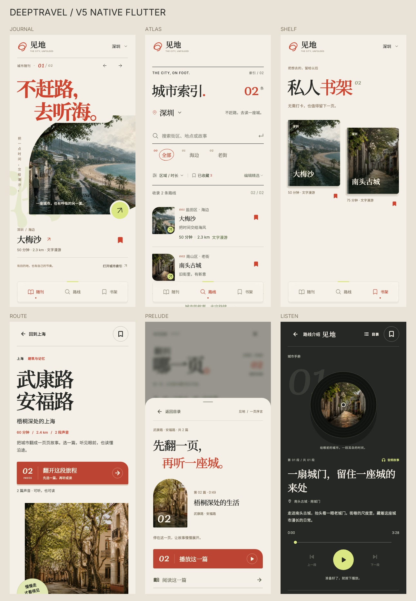

# V5 原生客户端改版

本次将已确认的「当代艺术杂志」设计实现为 Flutter 页面。设计参考源码保存在 `docs/design/v5-reference/`；这些文件仅供比对，不由客户端加载。旧版设计备份仍保留在原设计工作区。

## 主要流程

- 随刊／路线／书架采用原生页面与自绘摄影裁切，保留页内浏览状态。路线索引提供搜索、筛选、分批显示；书架使用已有收藏接口。
- 「翻开这段旅程」直接打开完整章节目录；目录每页 12 项，支持搜索、阅读状态过滤、原始章节编号和页码跳转。
- 选择章节先进入序页。用户明确选择听或读之后才进入相应模式，浏览目录不自动播放，也不触发定位到访。
- 目录返回保留筛选和位置。封面主按钮离开视口后按实际可见区域显示底部目录书签；播放器控制离开视口后显示底部播放栏。
- 播放中的唱片按 30 秒一周旋转，暂停停止，尊重系统减少动画设置。
- 现场随行在首页「随行」集中使用位置判断、到点提示与离线包；当前路线的手动听读通过路线目录进入。2026-09-30 已退役旧独立 Journey 界面，其到达问答、地图选点、社区／拼线索等旧界面不再展示。已有足迹、照片、服务端旅程数据与媒体接口仍保留。
- 原城市短篇保留在随刊底部次级入口；设置、账号与足迹仍通过侧栏访问。已删除无调用者的旧悬浮唱片入口、旧版出发前播放器分支与重复的独立行前下载器；保留完整路线离线包和旧 API 的数据兼容。

## 数据与媒体

`GET /api/v1/routes/:slug` 对已发布路线新增 `manual_chapters`，格式沿用完整章节序列化，按 position 排序。列表接口不附加全文。该只读接口不创建 Journey、ActiveTour、到访或播放记录；位置触发公开 manifest 的隐藏规则不变。客户端手动阅读记录独立按用户及路线存储。

不需要数据库迁移或管理端表单变更。部署时先更新后端，再使用新版客户端；旧后端没有 `manual_chapters` 时，客户端仍可读取现有路线文字。在线听读不受离线包 checksum 完整性门槛限制；离线下载仍执行原校验。

沿用现有 hero_image、站点图片、音频与 canonical OSS URL；没有迁移、覆盖或删除 OSS 对象，没有修改生产数据或种子图片路径。

## 字体与验证

本地内置 Noto Serif SC、Noto Sans SC、Inter；艺术数字用开源 Georgia 兼容字体 Gelasio。相应 OFL 许可证随资源打包并注册。设计默认比例按 390×844 和 360×800 验证，同时保留安全区和系统大字体适配。完整中文字体覆盖用于避免设备替换字形，增加约 42 MB 原始字体资源。

测试入口：

```sh
cd backend
python -m pytest
ruff check app tests
cd ../mobile
flutter analyze --no-pub
flutter test --no-pub
```

Flutter 测试验证原生渲染与交互，不产生 APK / IPA。真实 GPS、蓝牙耳机、锁屏持续播放与相机仍应在设备发布验收时复查。

## 本次验证结果（2026-09-28）

- Flutter 3.47.5 / Dart 3.13.4：静态分析无问题；完整客户端 167 项测试通过。
- 后端：110 项测试通过；Ruff 全量检查通过。
- 12 张原生截图作为 golden 基线保存于 mobile/test/goldens；路线封面、目录、序页与阅读的 8 张验收图保存于 docs/design/native-v5。
- 测试摄影源文件保存在 `mobile/test/fixtures`，可通过 `--dart-define=ROUTE_EVIDENCE_DIR=../docs/design/native-v5` 重新导出路线验收图。
- 截图使用与生产相同的 Flutter 组件、本地真实字体及测试图片替身，不依赖浏览器或 WebView。
- 本机测试使用临时 xcrun wrapper 选用已安装的 macOS 15.4 SDK，避开默认 SDK 与本机链接器不兼容；没有修改系统工具链配置。
- 未构建 APK/IPA，未部署后端，未改动管理端或 OSS 内容。




## 路线详情随行入口（2026-09-30）

已将批准的页边注式入口实现为原生 Flutter：标题「带上这条路。」与「定位发现 · 到点提醒」，右侧「去随行 ↗」采用原生细线绘制、83×12 笔迹下划线及轻微位移动效。82px 整行触控区替代原设置卡；390 / 360 宽度分别使用 21 / 20px 宋体标题、15 / 14px 操作文字，封面前后间距按确认稿对齐。支持减少动画。

「去随行」只导航到首页并预选当前路线，每次显式交接都有新的选择标识，避免同一条路线第二次进入时保留上次别的选择。跨城市与列表第五条以后的路线可载入；完整列表支持搜索。已有活动随行优先保留，不因进入页面而重置、请求定位或播放。加载失败会提示重试，不静默选择另一条路线。

定位方式和离线准备迁入首页「行走设置」，保留模式持久化、下载进度、失败重试、过期更新与离线启动。点击「开启随行」先确认准备，再创建／恢复旅程和启动定位；关闭准备层没有启动副作用。默认到点提示后由用户点击播放。

旧 Journey 页面和专属控件退役；旧 `/journey/:id` 链接仍可读取历史路线并转到新版随行，非定位路线转到手册。音频恢复、足迹恢复、回顾返回等入口统一改用新目的页。导航过程不覆盖现有会话、不自动开始定位。旧 UI 的业务控制器、历史数据和媒体地址保留，OSS 未发生写入或删除。本次无后端或 CMS 改动，也不打包客户端。

原生验收图（测试替身仅替换网络返回的测试图片，不修改生产 URL）：

- [390×844 路线详情](design/native-v5/route-cover-390.png)
- [360×800 路线详情](design/native-v5/route-cover-360.png)

回归覆盖详情到随行、跨城市预选、长路线列表、重复进入、取消准备、启动防重复、现有进度保护、旧链接兼容、定位方式和离线状态。界面 golden 位于 `mobile/test/goldens/route-companion-*.png`。

验证结果：`flutter analyze --no-pub` 无问题，完整客户端 175 项测试通过，`git diff --check` 通过。390×844、360×800 原生路线截图均通过比对；首页截图基线同步已有新版随行导航。随行信号动画在其他标签页停止计时，并尊重系统减少动画设置。
